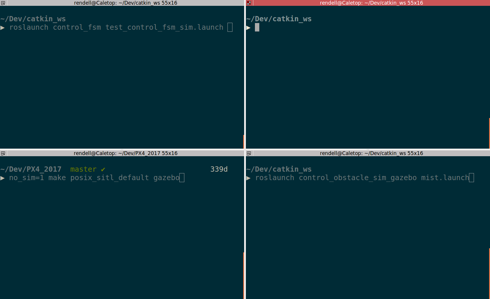

# control_obstacle_sim_gazebo
Drone and obstacle simulation in gazebo

# Guide
1) Clone the repo into catkin_ws/src, and clone PX4_2017 repo anywhere beneath your ~ folder, for instance your /home/$USER
2) Build your catkin_ws (with catkin_make)
3) source _source source_this_after_building.sh_
4) Prepare yourself
5) Open three (or four) terminal windows
    6.1. In the one that you sourced the file "source\_this\_after\_building.sh", execute _roslaunch control\_obstacle\_sim\_gazebo mist.launch_. This launches the gazebo world and perception emulator and is the only one necessary if you just want to view the world. If you want control over the drone, keep reading. 
    
    6.2. In another terminal, cd to the PX4\_2017 folder and execute "no\_sim=1 make posix\_sitl\_default gazebo". This launches sets up sitl simulation of PX4 firmware for gazebo. The no\_sim=1 indicates that the command shouldn't launch gazebo. This window is where the commander app lies, which allows low level control of drone
    
    6.3 In another terminal, launch control\_fsm (for instance with _roslaunch control\_fsm test\_control\_fsm\_sim.launch_)
7) Your terminal window should now look something like this 

